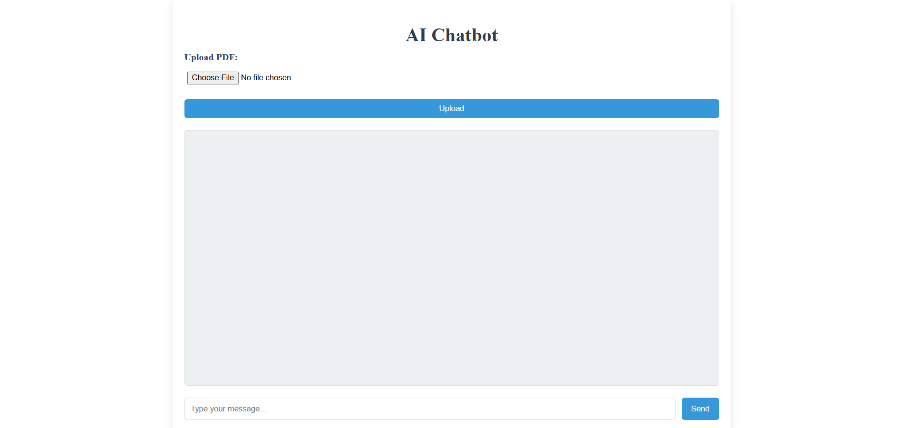

# AI-Chat-PDF-Assistant
A simple AI chatbot that lets users upload PDFs and interact with them via chat — now powered by FAISS for vector search and sentence-transformers for embeddings.

Features

- Upload PDF files
- Ask questions based on PDF content
- Uses FAISS for vector similarity search
- Uses sentence-transformers to generate embeddings
- Implements a Retrieval-Augmented Generation (RAG) workflow
- Simple frontend built with HTML, CSS, and JavaScript

How It Works

- Extract text from the uploaded PDF
- Split the text into smaller chunks
- Generate embeddings for each chunk
- Store embeddings inside a FAISS index
- Convert user questions into embeddings
- Search FAISS for the closest matching chunks
- Send retrieved chunks to the LLM to generate accurate answers

## 🚀 Setup Instructions

1️⃣ Clone the Repository

    git clone https://github.com/abdur-tech/AI-Chat-PDF-Assistant.git
    cd AI-chat-PDF-Assistant

2️⃣ Create and Activate a Virtual Environment

    python -m venv venv
    venv\Scripts\activate     # On Windows
    cd chatbot
    pip install -r requirements.txt

4️⃣ Set Up Environment Variables

    Create API key through https://openrouter.ai/google/gemma-3-12b-it:free 
    GET google gemma 3 12b LLM access key

    Create a .env file in the root directory and add:

        OPENAI_KEY=your_openai_api_key_here

5️⃣ Run the Flask Backend

    python app.py
    The backend will start at:
    http://127.0.0.1:5000

6️⃣ Start the Frontend Server

    python -m http.server 8000
    Access the UI at:
    http://127.0.0.1:8000/home.html

